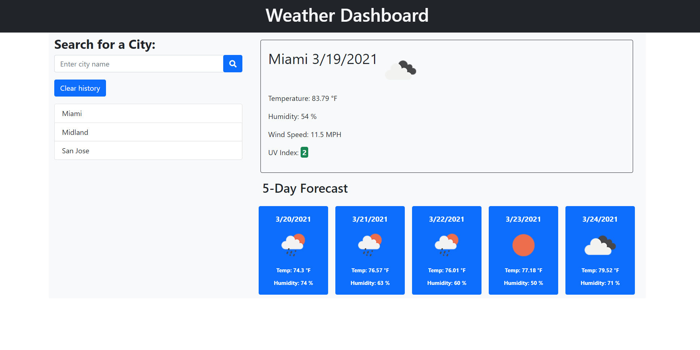

# Weather Dashboard

Weather Dashboard is a webpage that can be use to see current weather in a particular city. The page also provides a 5 day forecast for the same city. current weather and forecast is provided for the specific time when the search was done. So if search is done at 5 pm all forecast weather will be also the weather at about 5 pm on those days. The page also change color on the UV index depending on the value. For UV index less or equal to 2 the index will show green, for values between 2 and 5 will be yellow and for values over 5 will be red. Indicating this way the severity of the UV index.

Weather Dashboard is a webpage created using third party API's like Bootstrap and JQuery. The data is provided using a server side API "Open Weather API". The page tracks the last 10 searches on the local storage and those cities can be click directly on the list to display the weather.

## Website Screenshot

## Link to Website
[Weather Dashboard](https://hbbc248.github.io/weather-dashboard/)